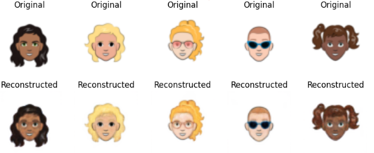

# Stable-Diffusion-Cartoon-Faces

## About

This repository contains a Stable Diffusion model to generate synthetic images of cartoon faces from a given prompt, trained using Skiittoo/cartoon-faces from Hugging Face.

## What is stable diffusion?

Stable Diffusion works by adding noise to a compressed image and then progressively denoising it with a UNet, guided by CLIP to align with the text prompt. Working directly in pixel space is computationally intensive (a 256x256x3 image contains over 196,000 pixels), so compression into a tighter latent space is preferred.

More abstractly, the model has two main components:

1. **VAE (Encoder/Decoder)** - Compresses and decompresses images.

2. **UNet (Bottleneck)** - Denoises and generates details to produce the final image.

## Training

Both the VAE and UNet were trained from scratch and their architectures can be found in `{unet/vae}_architecture.py`. Training was carried out on Kaggle using an NVIDIA TESLA P100.

### VAE training

The VAE was trained to encode 64x64x3 images into a spatial latent representation of size 4x4 with 4 channels. The general goal of the model during training was to minimise the:

1. **Reconstruction error**: Measures how well a model can recreate the original data from compressed representation.
2. **Kullback–Leibler (KL) divergence term**: Quantifies how much one probability distribution differs from a reference one.

The VAE was then trained for 50 epochs using the Adam optimiser with a learning rate of 0.0001. Visual inspection of the results show good results in the image below.

### UNet training

The UNet model was trained to operate on the 4×4×4 spatial latent representation produced by the VAE. It uses an encoder-decoder architecture with skip connections, progressively downsampling and upsampling spatial features. Convolutional layers are modulated by sinusoidal time embeddings that condition the model on diffusion timesteps. CLIP text embeddings are incorporated for multimodal guidance, enabling the model to steer generation based on text prompts.

The diffusion process uses a linear beta schedule to gradually add noise to the latent representations over timesteps. During training, a forward diffusion function applies noise according to this schedule, blending the original latent with Gaussian noise to create progressively noisier inputs. The UNet is then trained to predict this noise, optimising the mean squared error between predicted and true noise.

Training ran for 15 epochs using the Adam optimiser with a learning rate of 0.0002. The results of a test prompt "A cartoon face with facial hair and orange hair" are shown below.

## Inference

During inference, a text prompt is first encoded into a text embedding using CLIP’s text encoder. A random noise latent tensor (matching the VAE latent space shape) is then progressively denoised by the UNet model over many diffusion steps, conditioned on the CLIP text embedding and the current timestep (via time embeddings). The UNet predicts the noise to remove at each step, gradually refining the latent towards a clean image representation. Finally, the VAE decoder transforms the denoised latent back into a full-resolution RGB image. Generated results shown below look a little blurry but altogether very good!

